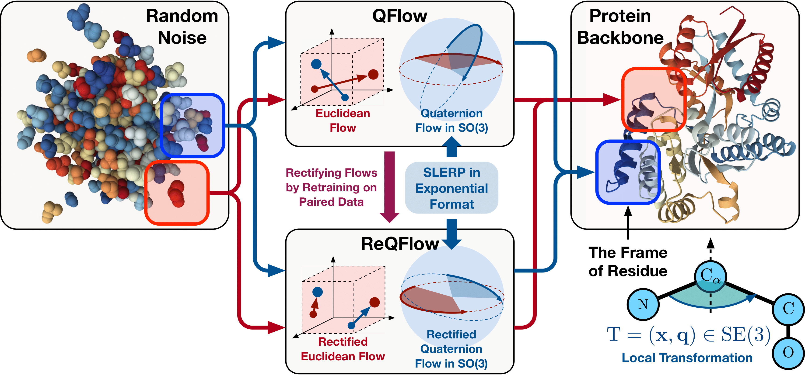
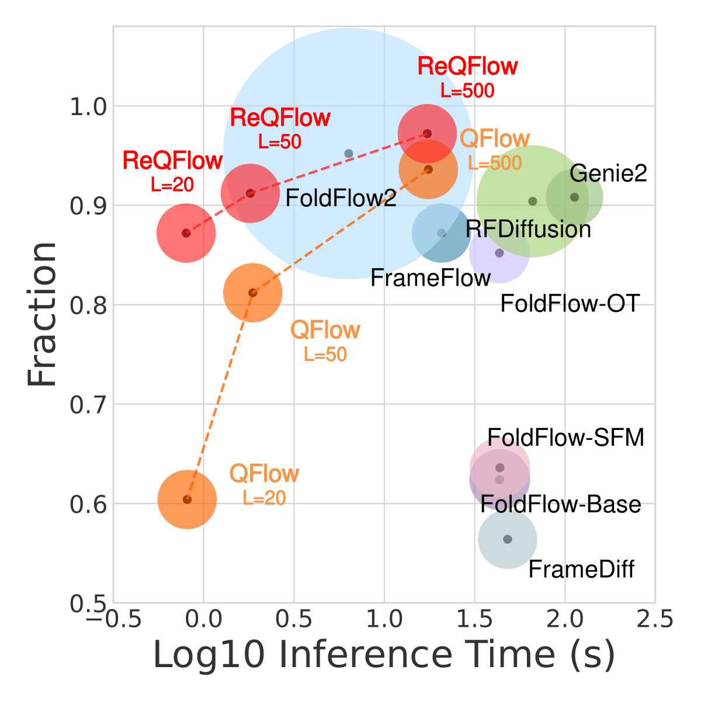
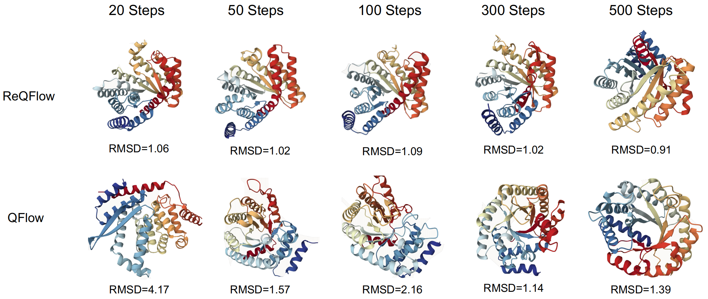

  
# ⚡️ReQFlow: Rectified Quaternion Flow for Efficient and High-Quality Protein Backbone Generation

<!-- 

  
  

  

 -->

  
  

  

## 🔥 News

* `2025/02/20` We release our work [ReQFlow]() for efficient and high-quality protein backbone generation!